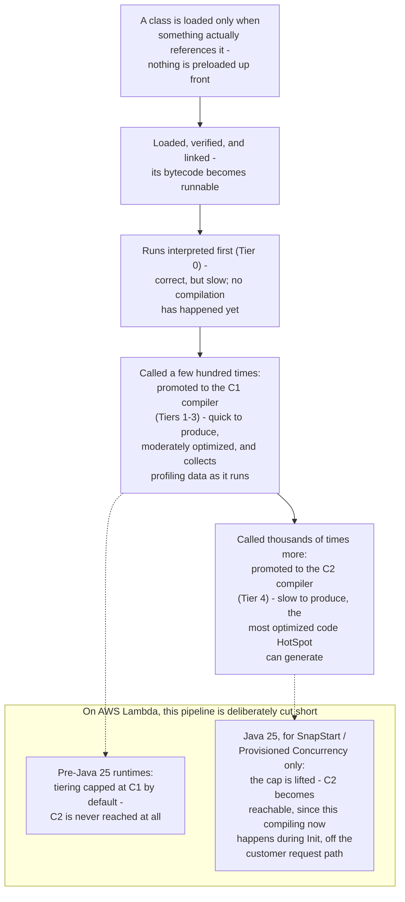
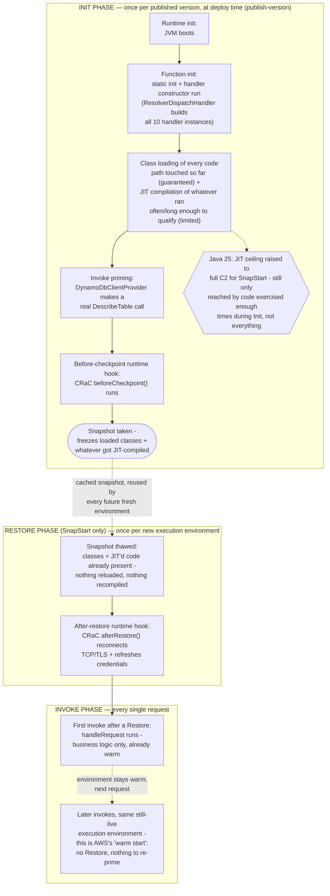

# Java Lambda cold-start mitigation (SnapStart + AWS SDK clients)

## Summary

Enabling Lambda SnapStart on a Java function is not, by itself, enough to make a cold request to
an AWS SDK-backed dependency (DynamoDB, S3, Cognito, SQS — any service client) fast. SnapStart
removes JVM startup and class-loading cost for whatever ran *before* the snapshot was taken, but
a lazily-built SDK client typically hasn't made its first real call by then, so the expensive
part — loading and interpreting the SDK's marshallers, HTTP client internals, and credential/
signing chain for the first time — simply moves to wherever that first call actually happens. Get
that placement wrong and SnapStart can look like it does nothing at all.

This document describes the mitigation implemented in this project (see
[DynamoDbClientProvider.java](src/main/java/com/mootmaker/dynamo/DynamoDbClientProvider.java) for
the concrete code), generalised to any AWS SDK for Java v2 client, along with the measurements
that motivated each change and a general SnapStart performance-tuning checklist.

## Two different costs, easy to conflate

A cold Lambda's first real call to an AWS service pays for two genuinely separate things:

1. **Class loading, then running brand-new code at interpreter speed.** The first time a code path
   is touched — the first `Scan`, the first `PutObject`, whatever — the JVM has to load classes it
   hasn't loaded yet (request/response models, the operation's generated marshaller/unmarshaller,
   retry logic, the SigV4 signer, the HTTP client's internals), and then run all of that new code in
   the plain bytecode interpreter, since none of it has been JIT-compiled yet — JIT compilation only
   kicks in after a piece of code has run *many* times, which a single first call generally hasn't.
   For a dependency as large as an AWS SDK client, this is routinely the *dominant* cost of a cold
   Lambda invocation — often several seconds, an order of magnitude more than the actual network
   work involved — and it's the class loading, not JIT, doing most of that damage.
2. **Network connection establishment.** DNS resolution, a TCP handshake, and a TLS handshake to
   the service endpoint, plus resolving credentials if they aren't already cached. Within an AWS
   region this is genuinely cheap — commonly tens of milliseconds, not seconds.

It's easy to see a slow first request and blame "the network," but in a Java Lambda the class
loading cost usually dwarfs it. The mitigation strategy below treats these as two separate
problems because SnapStart's snapshot mechanism treats them completely differently.

## Background: what class loading and JIT compilation actually cost

*Skip ahead to the
[lifecycle diagram](#lifecycle-diagram-init-phase-restore-phase-invoke-phase) below if this part is
already familiar.* Both halves of cost #1 above ("class loading / JIT, at interpreter speed") are
worth unpacking separately, because SnapStart's snapshot interacts with them differently and that
difference is exactly what the rest of this document exploits.



Two things worth keeping in mind from this before the Lambda-specific diagram below — and before
the priming pattern later in this document, since both facts explain exactly what that pattern is
and isn't buying you:

- **Class loading is lazy, and is *not* gated by how many times anything runs.** A class nobody has
  referenced yet costs nothing; a class touched *once* pays its full load/link/initialize cost, the
  same as a class touched a thousand times. This is why a cold DynamoDB `Scan` call is expensive: on
  the very first call, it's the *first* thing to touch the request/response POJOs, the generated
  marshaller/unmarshaller, retry logic, the SigV4 signer, the credential chain, and the HTTP
  client's own class graph, all at once — and one call is enough to pay that cost in full. AWS SDK
  for Java v2 is deliberately class-heavy — one class per shape/operation, trading a larger class
  graph for less runtime reflection — so all of that pays its loading cost together, on first touch.
  **This is the dominant win, and it's fully captured by a single call.**
- **JIT compilation, by contrast, genuinely is gated by how many times code runs** — the promotion
  thresholds above are invocation counts (or, for a method with an internal loop, loop-iteration
  counts — HotSpot also promotes a hot loop mid-method via "on-stack replacement" if it spins enough
  times in a *single* call). A method that's merely *referenced*, or called only once with no
  internal loop of consequence, stays in the slow interpreter tier regardless. **A single priming
  call is nowhere near enough, on its own, to promote most of the code it touches to C1, let alone
  C2** — it's only the handful of methods with a large enough internal loop (digest/signing
  computation, buffer copies, payload parsing) that stand a chance of crossing a tier threshold from
  one call. This matters a lot for what "priming" actually buys you — see the
  [Java 25 section](#java-25-removes-the-c1-cap-for-snapstart--what-changed-and-why-it-matters-here)
  below for the honest version of that story.

## What a SnapStart snapshot does and doesn't capture

SnapStart takes its snapshot **once**, immediately after your function's INIT phase completes —
this happens at `publish-version` time (i.e. at deploy time), not on a customer request. Every
later "cold start" against that published version is actually a **restore** from that frozen
snapshot, not a fresh JVM boot.

- **Captured, and reused for free on every restore:** loaded classes, whatever (typically modest)
  amount of JIT-compiled code exists, and any other JVM heap/metaspace state that existed at the
  moment of the snapshot. If your first real SDK call happened *before* checkpoint, its
  class-loading cost — the dominant part — is baked in regardless of how many times it ran; whatever
  JIT compilation that one call happened to trigger is baked in too, for what it's worth.
- **Not captured — must be redone on every restore:** open sockets, TLS session state, and
  anything else tied to the specific network environment the snapshot was taken in. AWS states
  this directly: *"The state of connections that your function establishes during the
  initialization phase isn't guaranteed when Lambda resumes your function from a snapshot."*
  (see [Networking best practices](https://docs.aws.amazon.com/lambda/latest/dg/snapstart-best-practices.html#snapstart-networking)).
  A restored execution environment gets a new network identity, so any connection object your
  client held at snapshot time is dead, even though it still looks "open" from the JVM's
  perspective.

This is the whole story: **whatever isn't exercised before checkpoint gets exercised, at
interpreter speed, sometime after restore** — either inside your handler on the customer's first
request (worst case), or in an `afterRestore` hook ahead of it (better, but still after restore).
The fix is to exercise it *before* checkpoint instead, so only the cheap connection-reestablishment
part is left for restore time.

## Lifecycle diagram: Init phase, Restore phase, Invoke phase

AWS names three relevant phases for a SnapStart function's execution environment — **Init**,
**Restore**, and **Invoke** — documented on
[Understanding the Lambda execution environment lifecycle](https://docs.aws.amazon.com/lambda/latest/dg/lambda-runtime-environment.html#runtimes-lifecycle).
Worth flagging up front, since it trips people up: AWS's own docs use the term **"warm start"**
specifically for the third box below (an *already-running* environment handling another request)
— not for the SnapStart-accelerated start in the second box, which AWS calls the **Restore phase**.
Both are far cheaper than a from-scratch cold start, which is exactly why they get blurred together
in conversation — but only the third one involves zero restore work at all.



Reading the diagram against the code in this project:

- **Class loading only ever happens in the Init phase** — specifically the "class loading + JIT
  compilation" step — never again during Restore or Invoke, for any environment restored from this
  snapshot. This is the entire reason the priming pattern below exists, and it's the *guaranteed*
  part of that step: whatever class isn't touched by the end of it and the "invoke priming" step
  right after doesn't get this one-time discount, and instead pays interpreter-speed class loading
  later, on the customer's request.
- **JIT compilation in that same step is real but much narrower** — it only promotes whatever
  specific methods got called (or looped) enough times during that one pass through Init, not
  everything that got loaded. Most of what a single priming call touches stays in the interpreter
  tier even after priming; only the busiest inner methods (signing, buffer copying, parsing) stand a
  realistic chance of being promoted. See the
  [anticipated-question callout](#java-25-removes-the-c1-cap-for-snapstart--what-changed-and-why-it-matters-here)
  in the Java 25 section below for the full "how does executing something once actually help"
  answer.
- The **Java 25 change lands squarely on that step's JIT half** (the hexagon callout hanging off
  it): on this project's runtime, the JIT tier reachable during Init for SnapStart is no longer
  artificially stopped at C1 — but, per the point above, only for whatever gets exercised enough to
  qualify in the first place. See
  [Java 25 removes the C1 cap for SnapStart](#java-25-removes-the-c1-cap-for-snapstart--what-changed-and-why-it-matters-here)
  below.
- The Restore phase's **"after-restore runtime hook" step** (the CRaC `afterRestore()` call) is
  comparatively cheap precisely *because* Init's class-loading and invoke-priming steps already did
  the expensive work — it's redoing a TCP/TLS handshake against already-warm, already-JIT'd code,
  not loading anything new.
- The Invoke phase's **"later invokes" step** is the only box in this whole diagram where literally
  nothing runs beyond your business logic — no restore, no reconnect, no priming. It's also the
  case this document's mitigation has *no effect on*, since there's nothing left to optimize (see
  [When this mitigation matters most](#when-this-mitigation-matters-most-and-when-it-doesnt) below).

One more nuance worth having in your back pocket for questions: the Init phase isn't strictly
"only ever runs once, ever" — AWS periodically re-runs it in the background to patch snapshots with
runtime and security updates ("Lambda automatically patches snapshots and their copies with the
latest runtime and security updates... Charges apply each time that Lambda re-runs your
initialization code to apply software updates"), independent of your own deploys. The mental model
in this diagram — Init happens at `publish-version`, Restore happens per fresh environment, Invoke
happens per request — still holds; it's just that "at `publish-version`" isn't the *only* trigger
for a fresh Init, AWS-initiated patching is another.

## The mitigation: split priming across two points in the client's lifecycle

The pattern, generalised from `DynamoDbClientProvider` to any lazily-built AWS SDK v2 client:

```java
public final class SomeAwsClientProvider {

    private static volatile SomeAwsClient client;
    private static Resource afterRestorePriming; // strong reference - see note below

    public static SomeAwsClient client() {
        if (client == null) {
            synchronized (SomeAwsClientProvider.class) {
                if (client == null) {
                    client = SomeAwsClient.builder().build();

                    // Runs here, in the same INIT-phase code path the Lambda Java runtime uses to
                    // construct your handler - which is unconditionally *before* SnapStart takes
                    // its snapshot. No CRaC hook is needed for this half: ordinary eager code in
                    // a static/lazily-initialised context already lands before checkpoint.
                    primeConnection(client);

                    afterRestorePriming = new AfterRestorePriming(client);
                    org.crac.Core.getGlobalContext().register(afterRestorePriming);
                }
            }
        }
        return client;
    }

    // A single, real, side-effect-free, cheap call representative of what this client actually
    // does - e.g. a metadata/describe-style read rather than a mutating operation - exercised
    // twice: once eagerly above (baked into the snapshot), once more from afterRestore below
    // (since the connection itself doesn't survive the snapshot regardless of what's primed).
    private static void primeConnection(SomeAwsClient client) {
        client.someCheapReadOnlyCall(...);
    }

    // Nothing re-runs static/lazy-init code on restore - a snapshot is thawed with its state
    // exactly as frozen. Only a registered CRaC afterRestore hook fires again on every restore,
    // which is the only way to redo the connection establishment that the snapshot couldn't keep.
    private record AfterRestorePriming(SomeAwsClient client) implements org.crac.Resource {
        @Override
        public void beforeCheckpoint(org.crac.Context<? extends Resource> context) {
        }

        @Override
        public void afterRestore(org.crac.Context<? extends Resource> context) {
            primeConnection(client);
        }
    }
}
```

Key mechanics of `org.crac` worth knowing:

- **`Context` only holds a `WeakReference` to a registered `Resource`.** If nothing else
  references it, it can be garbage collected before Lambda ever calls `afterRestore()` — hence
  the `static` field holding a strong reference in the example above. This is documented (with the
  exact failure mode) in AWS's
  [Lambda SnapStart runtime hooks for Java](https://docs.aws.amazon.com/lambda/latest/dg/snapstart-runtime-hooks-java.html)
  page.
- **Hook ordering**: `beforeCheckpoint()` runs in the reverse order resources were registered;
  `afterRestore()` runs in registration order.
- **Time limits**: `beforeCheckpoint()` counts toward the INIT time budget (130 seconds, or the
  function's configured timeout if longer). `afterRestore()` must complete within 10 seconds, or
  the restore fails with `SnapStartTimeoutException`.
- **The priming call must be idempotent/side-effect-free.** `beforeCheckpoint()` runs once per
  `publish-version`, not once per request, but it still shouldn't mutate real data — a metadata
  read (e.g. DynamoDB's `DescribeTable`, S3's `HeadBucket`, an SQS `GetQueueAttributes`) is a safe
  choice for any service, since it exercises the same client/marshaller/signing machinery as a
  real request without side effects.
- **Least-privilege IAM**: the priming call needs its own IAM grant like any other API call — in
  this project, `dynamodb:DescribeTable` was added to the Lambda execution role specifically for
  this purpose (scoped to the same table resources already granted). Whatever no-op-equivalent
  call you choose for another service will need the equivalent narrow grant.

## Java 25 removes the C1 cap for SnapStart — what changed, and why it matters here

**Lambda has quietly capped JIT tier since Java 17.** Independent of SnapStart, since the Java 17
runtime AWS Lambda has set `-XX:TieredStopAtLevel=1` by default — pinning every Java function to
tier 1 (C1, no profiling, never promoted to C2) — because for a typical short-lived invocation, the
extra CPU and memory C2 compilation costs on the invoke path usually aren't recouped before the
execution environment is recycled. This is documented, with the exact flag and rationale, on AWS's
[Customize Java runtime startup behavior for Lambda functions](https://docs.aws.amazon.com/lambda/latest/dg/java-customization.html)
page.

**As of the Java 25 Lambda runtime, that cap is lifted specifically for SnapStart and Provisioned
Concurrency** — both configurations where, unlike a plain cold start, class loading and JIT
compilation already happen *before* a customer request is ever served (during INIT/snapshot
preparation for SnapStart, during pre-provisioning for Provisioned Concurrency). Since that
compilation work is now happening off the invoke path rather than on it, AWS's rationale for the
Java 17 cap no longer applies, and Lambda uses the JVM's ordinary default tiered-compilation
settings for these two cases — meaning code exercised during INIT is no longer artificially
prevented from being promoted all the way to full C2-optimized tier 4, *for whatever code actually
gets exercised enough to qualify* (more on how little that turns out to be in practice, below).
This project's Lambda functions (`runtime = "java25"` in `deploy/terraform/lambda.tf`) are on this
runtime, so they get this by default with no extra configuration.

Concretely, for this project: `DynamoDbClientProvider.client()`'s `primeConnection(client)` call —
the one real `DescribeTable` call this project makes — runs during Lambda's INIT phase, strictly
before the SnapStart checkpoint. It's worth being precise about how many times this actually
happens, because it matters for the question below: `ResolverDispatchHandler` eagerly constructs
all 10 `XxxHandler` instances during Init, and each one's constructor calls
`DynamoDbClientProvider.client()` — but `client()` is a null-checked singleton, so only the *first*
handler constructed actually triggers `primeConnection`; the other nine just read the already-built
client. There is exactly **one** real `DescribeTable` call per Init phase, not ten.

Under the pre-Java 25 cap, whatever that one call warmed up could only ever reach C1-tier code.
Under Java 25 the ceiling is raised to C2 — but raising a ceiling doesn't mean one call reaches it.

> **Anticipated question: doesn't C1/C2 need hundreds or thousands of calls — so how does executing
> something once during Init actually help?**
>
> Two different things get warmed up here, and only one of them needs repetition. **Class loading,
> linking, and verification aren't gated by invocation count at all** — a class pays its full
> loading cost the moment it's first touched, whether that happens once or a thousand times. That's
> the dominant cost this whole document keeps coming back to, and one priming call captures all of
> it, full stop. **JIT compilation is the part that's actually gated by invocation count**, and
> HotSpot's own promotion rule isn't purely "called N times" — it's invocations *or*
> invocations-plus-loop-iterations, so a method with a large internal loop (SigV4's HMAC/digest
> computation, a buffer copy, a JSON/XML parser walking a payload) can rack up enough iterations to
> cross a tier threshold within a *single* top-level call, even though the outer method that called
> it (`execute()`, `marshall()`, `handleRequest()` itself) only ran once and stays interpreted
> regardless — nothing calls those outer methods 200 times either way, priming or not. So the
> honest picture: class loading is the large, guaranteed win, captured equally by one call or a
> thousand; the JIT win specific to *invoking* rather than merely *referencing* code is real but
> narrow, limited to whatever hot inner loops happen to iterate enough within that one call — and
> it's shared machinery (signing, marshalling, HTTP internals) reused by every one of this project's
> 10 operations, not wasted on a `DescribeTable` call nobody in production actually makes.

**Invoke priming vs. class priming.** AWS's own advanced-priming guidance distinguishes two
strategies: **invoke priming** — actually calling application code paths (what this project does: a
real `DescribeTable` call, a real handler construction) — versus **class priming** — merely forcing
classes to load via `Class.forName(...)` without running them. Both guarantee identical class
loading; the difference between them is entirely the narrow JIT sliver described above. Class
priming never executes a method body, so it never generates an invocation or iteration count and
never triggers any JIT compilation, however small. Invoke priming does execute real code, so
whatever hot loops exist on that path get a chance to be promoted. AWS's own measurements found
invoke priming roughly 1.8x faster than plain SnapStart versus roughly 1.4x for class priming
alone — a real but modest delta, consistent with the JIT contribution being a bonus on top of class
loading rather than a second dominant cost in its own right — see
[Optimizing cold start performance of AWS Lambda using advanced priming strategies with SnapStart](https://aws.amazon.com/blogs/compute/optimizing-cold-start-performance-of-aws-lambda-using-advanced-priming-strategies-with-snapstart/).
This project's `primeConnection` deliberately makes a real (if read-only, side-effect-free)
`DescribeTable` call rather than merely referencing `DynamoDbClient`/`ScanRequest`/etc. classes, for
exactly this reason — even though, per the callout above, the JIT-specific slice of that benefit is
modest next to the class-loading win both strategies get equally.

## Making sure priming code actually runs before checkpoint

SnapStart's INIT phase runs exactly once per **published version** — triggered by
`publish-version` (in this project, by `terraform apply` whenever `publish = true` picks up a
function-code or config change), not by any customer request. Only code that's guaranteed to
execute during that one INIT pass gets baked into the snapshot; everything else pays its cost after
restore instead, which is precisely the failure mode described earlier ("SnapStart can look like it
does nothing at all"). Concretely, code lands in the INIT phase only if it's reached from one of
three places:

- A **static initializer** or static field initializer.
- The **handler class's constructor** — the Lambda Java runtime always instantiates your handler
  via its public no-arg constructor once, during INIT, before it ever routes a request to
  `handleRequest`. This is why `DynamoDbClientProvider.client()`'s first call happens from inside
  `ListRoomsHandler`'s (and every other handler's) constructor, and why `ResolverDispatchHandler`
  builds its entire `Map.ofEntries(...)` of handler instances *eagerly in its own constructor*
  rather than lazily on first lookup — both patterns exist specifically to guarantee the priming
  call's invocation happens during this one-time INIT pass rather than depending on which field a
  customer happens to request first.
- A registered **CRaC `beforeCheckpoint()` hook**.

Code that only runs conditionally inside `handleRequest()` — guarded behind a lazy-init check, for
instance — will **not** run during INIT unless one of the three paths above forces it to, since
there is no incoming request at publish time to trigger it; it silently defers to the customer's
first real invocation instead, exactly the "moves to wherever that first call actually happens"
trap this document opened with.

**Verifying it actually happened**, rather than assuming it from reading the code: Lambda writes
the INIT phase's logs — including any `System.out`/logger output your priming code produces — to
the function's CloudWatch log group at `publish-version` time, before any invocation occurs. A log
line from `primeConnection` timestamped at publish time (rather than only appearing later, on first
invoke) confirms priming ran before checkpoint, not after restore. Cross-checking this against the
`Restore Duration` figures in the measurement table below is the more indirect but equally valid
alternative — a large `Restore Duration` on the first post-restore invocation is itself a strong
signal that expensive work is *still* landing after restore rather than before checkpoint.

## Why the after-restore reconnection step still matters, and what it costs

Even with everything primed before checkpoint, `afterRestore()` (or equivalent handler-body logic)
is still required, because the TCP/TLS connection and any cached credentials are invalid the
moment a snapshot restores — independent of whether the code that would use them has been
warmed. Skipping this and just relying on the (now class-loaded) client to lazily reconnect on the
customer's first real request still puts a real, synchronous reconnect on that
request's critical path — just a much cheaper one than before, since it's now "only" a fresh
TCP + TLS handshake and credential resolution, not also a cold class load.

In this project's own before/after measurements (`test-mootmaker-list-rooms`, forced-cold
invocations, 3 samples each — see the project's PR history / conversation log for full detail).
Note: this was measured against the standalone `list-rooms` function that existed before the
switchboard consolidation (see [switching-to-a-switchboard-lambda.md](switching-to-a-switchboard-lambda.md));
that function no longer exists on its own, having been folded into `resolvers`, so these numbers
predate that change and haven't been re-measured against it:

| Configuration | Init/Restore Duration | Handler `Duration` (first real DynamoDB call) | Total wall clock | Billed |
|---|---|---|---|---|
| No SnapStart | ~1.35s (JVM boot only) | ~3.3s (class load + connect, at interpreter speed) | ~4.65s | ~4.65s |
| SnapStart, priming only in `afterRestore` | ~3.94s (class load + connect now happens here) | ~0.40s | ~4.34s | ~3.65s |
| SnapStart, priming both eagerly (pre-checkpoint) **and** in `afterRestore` | ~1.0s (connection only) | ~1.1s | **~2.1s** | **~1.4s** |

Splitting the two costs across both hook points cut total cold-request latency by roughly 55% and
billed compute by roughly 70% compared to no SnapStart at all — and meaningfully beat priming in
`afterRestore` alone, because that configuration was still paying the full class-loading cost, just
moved from the customer-visible `Duration` into `Restore Duration` (which still blocks the response
for an isolated cold request — see the next section).

One open question from this project's own measurements: the third configuration's `Duration`
(~1.1s) was *higher* than the second's (~0.40s), despite classes being at least as warm. The
working hypothesis, not yet confirmed, is that the JDK's own HTTP keep-alive connection cache
(relevant if using `url-connection-client`, which is built on `java.net.HttpURLConnection`) may
retain a reference to the connection opened during the pre-checkpoint priming call, get that
stale reference frozen into the snapshot, and pay a silent failed-reuse-then-reconnect cycle on
the first real post-restore request. A related, though not identical, restore-phase slowdown from
CRaC-primed connections has been reported for the SDK's async (Netty) client — see
[aws/aws-sdk-java-v2#3801](https://github.com/aws/aws-sdk-java-v2/issues/3801). If pursuing this
further, explicitly discarding/closing the connection in `beforeCheckpoint()` rather than leaving
it open across the checkpoint boundary would be the next thing to try.

## When this mitigation matters most (and when it doesn't)

This whole exercise is about the **first invocation of a freshly-restored execution environment**.
It has no effect on warm invocations, which were already fast (the client and connection are
already live, nothing to prime). It matters most for **intermittent, bursty traffic**, where a
large fraction of real requests land on a fresh restore rather than a warm environment — under
sustained, steady traffic, most requests hit already-warm environments and this cost is amortised
away regardless. AWS makes the same point directly: *"SnapStart works best when used with function
invocations at scale. Functions that are invoked infrequently might not experience the same
performance improvements."* — which, somewhat counter-intuitively, is exactly the traffic pattern
where the priming strategy above earns its keep, since it's the only lever left once you can't
rely on scale to amortise the cost away.

## General SnapStart performance-tuning checklist

- **SnapStart only ever applies to a published version, never `$LATEST`.** Set
  `snap_start.apply_on = "PublishedVersions"`, publish a version on every deploy, and point real
  traffic (API Gateway/AppSync integrations, Cognito triggers, etc.) at an alias tracking that
  version rather than the function directly — otherwise SnapStart is configured but silently
  inactive.
- **Prefer "invoke priming"** (exercising real code paths, including real dependency calls, before
  checkpoint) **over "class priming"** (merely referencing classes to force loading without
  running them) where possible — both capture identical class loading (the dominant cost either
  way), but only invoke priming has any chance of also triggering JIT compilation for whatever hot
  inner loops that one call happens to exercise enough. See AWS's
  [Performance tuning](https://docs.aws.amazon.com/lambda/latest/dg/snapstart-best-practices.html#snapstart-tuning)
  guidance and its worked example (constructing a fake request and driving it through the real
  handler before checkpoint).
- **Re-establish network connections after restore** — in an `afterRestore` hook or the first
  lines of the handler — for every external connection your function holds, not just AWS SDK
  clients: any other TCP/TLS connection your INIT code opened has exactly the same problem.
- **Don't use `hostname` as a unique execution-environment identifier.** Every environment
  restored from the same snapshot reports the same hostname; generate a fresh unique ID in
  `afterRestore()` or the handler if you need one.
- **Avoid a second DNS cache on top of Lambda's own.** If something on the classpath enables the
  JVM's DNS cache (the AWS docs specifically call out `java.util.logging.Logger` as an indirect
  trigger), set `networkaddress.cache.ttl` to `0` before it's initialised, and set
  `AWS_LAMBDA_JAVA_NETWORKADDRESS_CACHE_NEGATIVE_TTL=0` on Java 11 (unnecessary on Java 17+).
- **Don't bind connections to a fixed source port** — they're re-established on restore and a
  fixed-port binding can fail.
- **Expect credentials resolved before checkpoint to be stale by the time of restore** (which can
  be minutes, hours, or days later). AWS SDK v2's standard credential providers check expiry
  before returning a cached value, so this is generally self-healing — but it's worth explicitly
  verifying against your actual credential provider chain rather than assuming it, particularly
  if anything custom is layered on top of it.
- **Newer Java runtimes changed the JIT trade-off.** This project is already on the Java 25 Lambda
  runtime, which lifts Lambda's long-standing C1-only cap for SnapStart and Provisioned
  Concurrency, raising the ceiling on how far invoke-primed code *can* be promoted before
  checkpoint (up to C2, not just C1) — though how much of that ceiling any given priming call
  actually reaches still depends on how many times its hot code paths get exercised. See
  [Java 25 removes the C1 cap for SnapStart](#java-25-removes-the-c1-cap-for-snapstart--what-changed-and-why-it-matters-here)
  above for the mechanics, the honest limits, and what it means for this project's priming code
  specifically.
- **Keep the shaded/deployment artifact small.** Every class on the classpath is a class that can
  end up loaded during INIT; this project separately excludes unused AWS SDK HTTP client
  implementations (`apache5-client`, `netty-nio-client`) from the shaded jar for exactly this
  reason (see the top-level project README's cold-start notes).
- **Measure with forced-cold, concurrent invocations**, not sequential ones — after the first
  invoke against a freshly-published version, subsequent invokes typically reuse the same
  already-restored (now warm) execution environment. Firing several `aws lambda invoke` calls
  concurrently against a just-published version's alias reliably forces distinct fresh restores,
  and `--log-type Tail` returns the `REPORT`/`RESTORE_REPORT` log lines directly in the CLI
  response without a CloudWatch Logs query.

## References

**AWS Lambda SnapStart**
- [Understanding the Lambda execution environment lifecycle](https://docs.aws.amazon.com/lambda/latest/dg/lambda-runtime-environment.html#runtimes-lifecycle) — the official Init/Restore/Invoke/Shutdown phase names and definitions (source for the lifecycle diagram above, including the "warm start" terminology clarification)
- [Improving startup performance with Lambda SnapStart](https://docs.aws.amazon.com/lambda/latest/dg/snapstart.html) — overview
- [Maximize Lambda SnapStart performance](https://docs.aws.amazon.com/lambda/latest/dg/snapstart-best-practices.html) — performance tuning and networking best practices (source for the DNS cache, hostname, and fixed-source-port guidance above)
- [Implement code before or after Lambda function snapshots](https://docs.aws.amazon.com/lambda/latest/dg/snapstart-runtime-hooks.html) — runtime hooks overview
- [Lambda SnapStart runtime hooks for Java](https://docs.aws.amazon.com/lambda/latest/dg/snapstart-runtime-hooks-java.html) — `org.crac` usage, the `WeakReference`/strong-reference gotcha, hook ordering, and timing limits
- [Activating and managing Lambda SnapStart](https://docs.aws.amazon.com/lambda/latest/dg/snapstart-activate.html)
- [AWS Lambda now supports Java 25](https://aws.amazon.com/blogs/compute/aws-lambda-now-supports-java-25/) — the tiered-compilation/SnapStart change
- [Customize Java runtime startup behavior for Lambda functions](https://docs.aws.amazon.com/lambda/latest/dg/java-customization.html) — the `-XX:TieredStopAtLevel=1` default since Java 17, the `JAVA_TOOL_OPTIONS` override, and the exact Java 25/SnapStart/Provisioned-Concurrency exception (source for the "Java 25 removes the C1 cap" section above)
- [Optimizing cold start performance of AWS Lambda using advanced priming strategies with SnapStart](https://aws.amazon.com/blogs/compute/optimizing-cold-start-performance-of-aws-lambda-using-advanced-priming-strategies-with-snapstart/) — invoke priming vs. class priming, with measured speedups (source for the 1.8x/1.4x figures above)

**Java JIT / class loading background (general, not AWS-specific)**
- [How Tiered Compilation works in OpenJDK](https://devblogs.microsoft.com/java/how-tiered-compilation-works-in-openjdk/) — HotSpot's five compilation tiers, C1 vs. C2, and invocation-count promotion thresholds
- [Tiered Compilation in JVM](https://www.baeldung.com/jvm-tiered-compilation) — a more introductory walkthrough of the same tiers, useful background if C1/C2 terminology is new

**CRaC (Coordinated Restore at Checkpoint)**
- [CRaC project — OpenJDK wiki](https://wiki.openjdk.org/display/crac)
- [CRaC step-by-step guide](https://github.com/CRaC/docs/blob/master/STEP-BY-STEP.md)
- [`org.crac` Javadoc](https://javadoc.io/doc/io.github.crac/org-crac/latest/index.html) — `Resource`, `Context`, `Core`
- [`org.crac:crac` on Maven Central](https://search.maven.org/artifact/org.crac/crac) — the dependency this project uses (`impl/pom.xml`)

**Known related issue**
- [aws/aws-sdk-java-v2#3801 — Auto priming support](https://github.com/aws/aws-sdk-java-v2/issues/3801) — feature request for the SDK to handle priming automatically; also documents a reported restore-phase slowdown from CRaC-primed connections on the async client, relevant to the open question above
