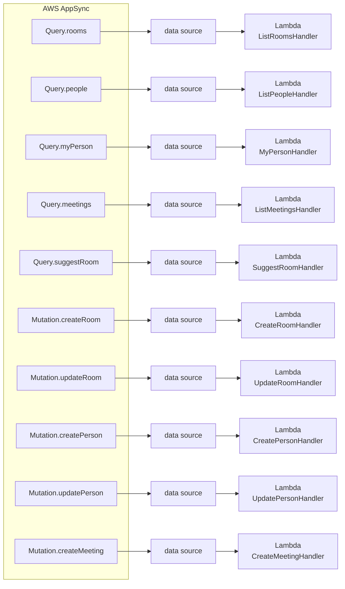
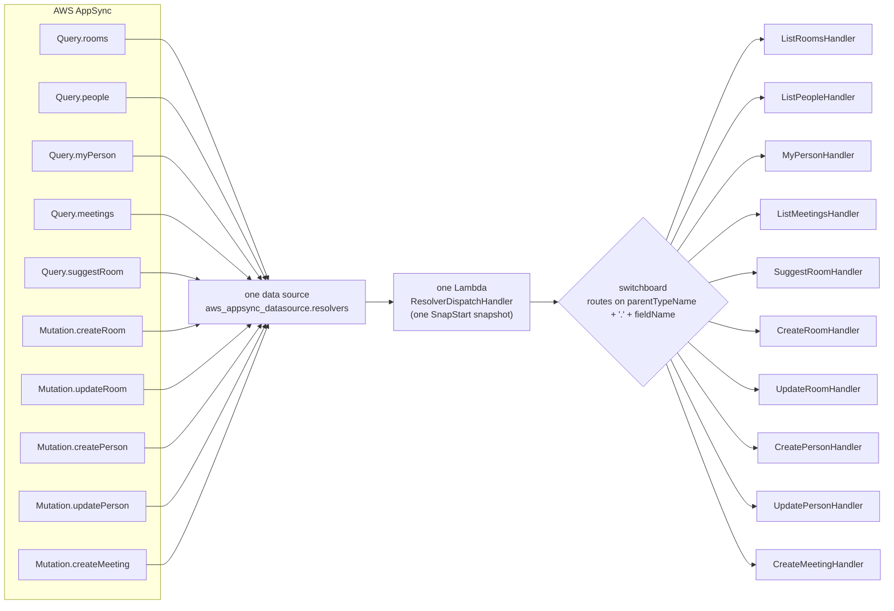

# Consolidate AppSync-resolver Lambdas into one dispatched function

**Status: implemented.** See [ResolverDispatchHandler.java](src/main/java/com/mootmaker/handler/ResolverDispatchHandler.java), `aws_lambda_function.resolvers` and `aws_appsync_datasource.resolvers` in [deploy/terraform/lambda.tf](../deploy/terraform/lambda.tf)/[appsync.tf](../deploy/terraform/appsync.tf), and the README's [How it is implemented](../README.md#how-it-is-implemented) section. The rest of this document is kept as the design record for why and how, written at proposal time.

## Context

Today, 10 of the project's 11 Lambda functions each serve exactly one AppSync direct-Lambda
resolver field (`Query.rooms`, `Query.people`, `Query.myPerson`, `Query.meetings`,
`Query.suggestRoom`, `Mutation.createRoom`, `Mutation.updateRoom`, `Mutation.createPerson`,
`Mutation.updatePerson`, `Mutation.createMeeting`), each with its own SnapStart snapshot. A single
webapp interaction (e.g. loading a page that queries rooms, people, and meetings) fans out across
several of these independently-cold-starting functions. The goal is to consolidate all 10 into one
Lambda, with AppSync telling it which operation to run and a switchboard dispatching to per-operation
business-logic classes — so a burst of calls from one user session can be served by a single warm
execution environment instead of several independently-restoring ones.

**Important calibration on the expected benefit**, surfaced now so it isn't oversold: Lambda serves
one invocation per execution environment at a time. If a user's calls arrive genuinely
*concurrently* (multiple in flight simultaneously), consolidation doesn't avoid needing multiple
environments for that instant — each still restores independently, exactly as today. The real wins
are (a) **sequential reuse**: once any one call has restored an environment, every *subsequent*
call in that session — regardless of which of the 10 operations it is — can land on that same
already-warm environment, which never happens today since each operation is pinned to its own
function; and (b) **steady-state warm-hit-rate**: consolidating 10 low-individual-volume functions
into one high-combined-volume function means environments get reused more often and reclaimed less
aggressively in aggregate. Both are real and worth having; neither is "every burst pays only one
restore, guaranteed."

## Before / after

**Before** — 10 independent AppSync data sources, each backed by its own Lambda function with its
own SnapStart snapshot. A single page load that queries `rooms`, `people`, and `meetings` can cold
start three unrelated execution environments, even though it's one user's one page load.

*10 functions, 10 SnapStart snapshots, 10 independently-restoring execution environments.*

**After** — one AppSync data source, backed by one Lambda function
(`ResolverDispatchHandler`) with one SnapStart snapshot. AppSync already sends
`$context.info.parentTypeName` / `.fieldName` in every request; the dispatcher uses that to route
in-process to the same unchanged per-operation handler classes.

*Same 10 business-logic classes, unchanged — only how a request reaches them changes. Once any one
field has restored the shared environment, every other field's call in that session can land on
that same warm environment (see the calibration note above for exactly what this does and doesn't
guarantee).*

## Recommended approach

**New dispatcher class** — `com.mootmaker.handler.ResolverDispatchHandler`, alongside the existing
handlers it dispatches to. AppSync's `$context.info` (`fieldName`, `parentTypeName`) is already
forwarded today via the shared `$util.toJson($ctx)` request template, confirmed against AWS's
resolver-context-reference docs — so **no VTL/template changes are needed** for routing; the key is
already in every payload, just unused today.

- Routing key: `parentTypeName + "." + fieldName` (e.g. `"Mutation.createMeeting"`). All 10 fields
  are already distinct by `fieldName` alone; including `parentTypeName` is cheap future-proofing.
- Build a `Map<String, RequestHandler<Map<String,Object>,Object>>` **eagerly in the constructor**
  (one `new XxxHandler()` entry per operation), not lazily per-request — this mirrors the project's
  existing SnapStart philosophy (see `DynamoDbClientProvider`'s priming hook): constructing all 10
  handlers during INIT means they're all swept into the snapshot. This does **not** create 10
  separate DynamoDB/Cognito clients or priming calls — `DynamoDbClientProvider`/
  `CognitoIdentityProviderClientProvider` are already static singletons, so the first `XxxHandler()`
  constructor call creates/primes the shared client and the other 9 just read it.
- `handleRequest` looks up the routing key in the map and delegates; an unmatched key or missing
  `info` throws `IllegalStateException`, matching `Identity.java`'s existing defensive-failure idiom.
- New `ResolverDispatchHandlerTest` in `impl/src/test/java/com/mootmaker/handler/`, using a
  package-private map-injecting constructor (same test-injection pattern every other handler
  already uses) with stub `RequestHandler` entries, to verify correct routing and the two failure
  cases (missing `info`, unrecognized key).

**Existing handler classes need zero changes.** Confirmed by re-reading `ListRoomsHandler`,
`UpdatePersonHandler`, and `CreateMeetingHandler`: each is a self-contained
`RequestHandler<Map<String,Object>,Object>` with a public no-arg constructor and a package-private
test constructor, with no assumption about which physical Lambda invokes it. This is purely
additive — one new class, no diffs to the 10 `XxxHandler` classes or their tests. All 11 functions
already share one shaded jar (`impl/target/mootmaker-api.jar`), so no build/packaging change either.

**`deploy/terraform/lambda.tf`**: replace the 10 per-field `aws_lambda_function` + `aws_lambda_alias`
pairs with one `aws_lambda_function.resolvers` (`handler =
"com.mootmaker.handler.ResolverDispatchHandler::handleRequest"`, same `memory_size = 512`,
`timeout = 15`, `runtime = "java25"`, `publish = true`, `snap_start { apply_on = "PublishedVersions" }`
as today) + one `aws_lambda_alias.resolvers_live`. Its env vars are the union of what the 10 handlers
collectively need — `merge(local.admin_gated_env_vars, { COGNITO_USER_POOL_ID = ... })` — safe to
merge unconditionally here since (unlike `post_confirmation_create_person`) this function isn't
itself referenced by `aws_cognito_user_pool.this`, so the existing circular-dependency concern
documented on `admin_gated_env_vars` doesn't apply. `post_confirmation_create_person` (the Cognito
PostConfirmation trigger) is **left exactly as-is** — different event shape (a Cognito trigger
event, not an AppSync `$ctx`), fires once per sign-up rather than as part of an interactive
multi-field burst, so folding it in would mean branching on event shape for no latency benefit.

**`deploy/terraform/appsync.tf`**: AppSync supports multiple resolvers sharing one Lambda data
source. Collapse the 10 `aws_appsync_datasource` blocks into one
(`aws_appsync_datasource.resolvers`, `lambda_config.function_arn = aws_lambda_alias.resolvers_live.arn`),
and repoint each of the 10 `aws_appsync_resolver` blocks' `data_source` at it.
`request_template`/`response_template` stay exactly as `local.direct_lambda_request_template` /
`direct_lambda_response_template` — unchanged.

**`deploy/terraform/iam.tf`**: only `data.aws_iam_policy_document.appsync_invoke_lambda`'s
`resources` list changes, from 10 alias ARNs down to `[aws_lambda_alias.resolvers_live.arn]`.
`aws_iam_role.lambda_exec` and its DynamoDB/Cognito policies are untouched (already grant the union,
scoped to tables/pool, not per-function).

**Deploy mechanics note**: this renames/removes Terraform resource addresses, so `terraform apply`
will plan to destroy the 10 old function/alias/datasource resources and create the new ones — there's
no clean 1:1 `state mv` given the 10→1 collapse. Review `terraform plan` output before applying.

## Trade-offs (accepted, not blocking)

- All 10 fields now share one function's concurrency/scaling pool instead of 10 independent ones —
  a burst on one field can now affect cold-start behavior for another.
- A bad deploy affects all 10 resolver fields at once instead of one.
- CloudWatch logs for all 10 operations interleave in one log group instead of 10.

## Verification

1. **Unit tests** (`mvn test` in `impl/`) — all 10 existing `XxxHandlerTest` classes pass unmodified;
   new `ResolverDispatchHandlerTest` covers routing and failure cases.
2. **`terraform plan`** review before applying, in the `test` workspace — confirm the diff is exactly
   {destroy 10 function/alias/datasource sets, create 1, update 10 resolvers' `data_source`, shrink
   `appsync_invoke_lambda`'s resource list}.
3. **`./verify.sh test`** — the existing acceptance suite hits the deployed GraphQL API over HTTP and
   doesn't know which Lambda serves which field, so an unmodified pass is a real regression check
   that all 10 operations still work correctly behind the one consolidated function.
4. **Latency validation**, using the same forced-cold technique from the earlier SnapStart work
   (`aws lambda invoke --qualifier live --log-type Tail`, decoding `LogResult` for
   `REPORT`/`RESTORE_REPORT` lines):
   - **Sequential-burst comparison** (the real before/after number): against fresh environments,
     fire `rooms` → `people` → `meetings` one after another. Today, expect a `RESTORE_REPORT` on all
     three (three separate functions/environments). After consolidation, expect `RESTORE_REPORT`
     only on the first call, with the 2nd/3rd showing ordinary warm `REPORT` lines — same
     environment reused.
   - **Steady-state spot check** (directional): a staggered, realistically-paced mixed-field call
     pattern over a longer window, comparing the proportion of cold (`RESTORE_REPORT`-bearing)
     invocations before vs. after.
